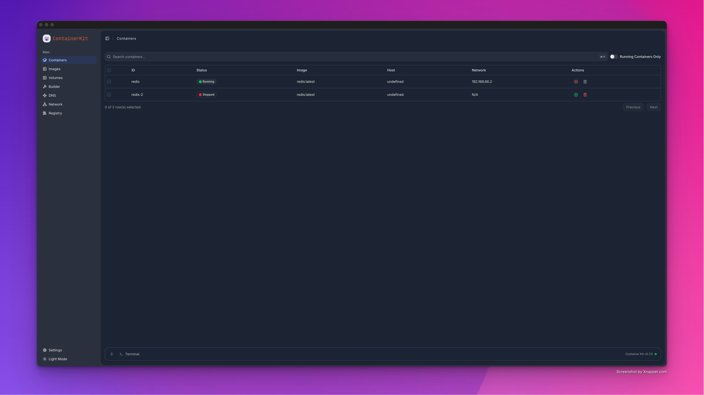
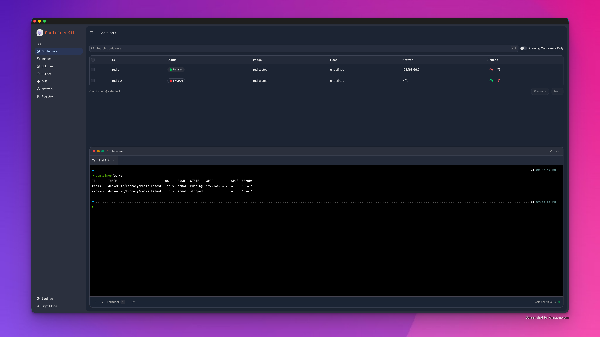

<div align="center">
  

# Container Kit

**A modern desktop application for Apple container management**

[](https://opensource.org/licenses/Apache-2.0)
[](https://tauri.app)
[](https://svelte.dev)
[](https://www.typescriptlang.org)
[](https://www.rust-lang.org)

_Built with Tauri, Svelte 5, Typescript • Features beautiful native interface for managing macOS containers, sandboxes, and virtualization_

> **⚠️ UNDER HEAVY DEVELOPMENT** - This project is actively being developed and may have breaking changes. Only supports **macOS 26.0+** with Apple Silicon.

[Features](#-features) • [Installation](#-installation) • [Usage](#-usage) • [Development](#-development) • [CLI Tools](#-cli-tools)

</div>

---

## 🚀 Overview

Container Kit is a comprehensive desktop application designed specifically for Apple ecosystem container management. It provides a beautiful interface for managing macOS app containers, sandboxes, virtualization environments, and more, all while maintaining the highest standards of security and performance that developers expect.

> **🚧 Development Status**: This project is under heavy development. Features and APIs may change significantly between releases. We rely on apple container cli which is still in development and may have breaking changes.

### 🎯 Key Highlights

- **🍎 Apple-First Design** - Built specifically for macOS 26.0+ with native Apple HIG compliance
- **⚡ Modern Architecture** - Tauri + Svelte 5 + Typescript developer experience
- **🛡️ Security Focused** - Comprehensive sandbox and container security management
- **🎨 Beautiful Interface** - Multiple theming options with dark/light modes and smooth animations
- **🚨 Development Phase** - Active development with frequent updates and changes

## ✨ Features

### 🏗️ Container Management

- **App Sandbox Containers** - Manage sandboxed macOS application environments with Apple's container CLI
- **System Containers** - Handle isolated service environments and system processes with Apple's container CLI
- **Virtualization Containers** - Full integration with Apple's container CLI
- **Container Networking** - Advanced networking configuration for Apple virtualization
- **DNS Management** - Container-specific DNS settings and resolution
- **Registry Management** - Apple container configuration and policy management

### 🎨 Developer Experience

- **ShadCN Interface** - Follows ShadCN Interface Guidelines
- **Dark/Light Themes** - Automatic theme switching with system preferences
- **Smooth Animations** - Powered by Motion library for fluid interactions
- **Data Visualization** - Beautiful charts and graphs with LayerChart
- **Responsive Design** - Optimized for various screen sizes and resolutions

### 🛠️ Developer Tools

- **TypeScript Scripts** - Comprehensive build and automation scripts
- **Migration System** - Robust database schema management with version control
- **Build Pipeline** - Custom Tauri build system with Apple code signing
- **Type Safety** - Full TypeScript integration throughout the stack

## 📸 Screenshots

### Main Dashboard

_Beautiful overview of your container ecosystem_



### Terminal Integration

_Integrated terminal for advanced container commands_



### Settings & Configuration

[//]: # '_Comprehensive configuration options_'
[//]: #
[//]: # ''

## 🚀 Installation

### Prerequisites

> **⚠️ IMPORTANT**: Container Kit requires macOS 26.0 or later and is only compatible with Apple Silicon Macs.

- **macOS 26.0+** (Required - older versions not supported)
- **Apple Silicon Mac** (M1/M2/M3/M4 - Intel Macs not supported)
- **Xcode Command Line Tools**

```bash
xcode-select --install
```

### Download

#### Option 1: Direct Download (Recommended)

> **🚧 Note**: Pre-built releases may not be available during development phase. Use build from source option below.

1. Download the latest `.dmg` from [Releases](https://github.com/etherCorps/ContainerKit/releases)
2. Open the downloaded `.dmg` file
3. Drag Container Kit to your Applications folder
4. Launch from Applications or Spotlight or Terminal

#### Option 2: Build from Source (Recommended during development)

```bash
# Clone the repository
git clone https://github.com/etherCorps/ContainerKit.git
cd ContainerKit

# Install dependencies (requires pnpm)
npm install -g pnpm
pnpm install

# Download Apple Container CLI (macOS only)
./scripts/download-apple-container-cli.sh

# Build the application
pnpm tauri:build
```

### First Launch

1. **Grant Permissions** - Container Kit requires system permissions for container management.
2. **Code Signing** - The app is signed and notarized for security - Currently apple is not allowing to enroll me in the developer program.
3. **Initial Setup** - Follow the welcome wizard to configure your environment - Maximum things are one time setup.

## 🏗️ Development

### Tech Stack

- **Frontend**: Svelte 5, SvelteKit, TypeScript, TailwindCSS
- **Backend**: Tauri 2.x, Rust, Sqlx, Drizzle ORM
- **Build**: TypeScript automation scripts, pnpm, Vite

### Quick Start

```bash
# Install dependencies
npm install -g pnpm
pnpm install

# Start development server
pnpm dev

# Build application
pnpm build:tauri
```

For detailed setup, architecture, project structure, and development workflows, see our [Contributing Guide](CONTRIBUTING.md).

## 📋 Scripts Reference

### Core Development Commands

```bash
pnpm tauri dev           # Development server with hot reload
pnpm tauri:build         # Production frontend build
```

### Database Management

```bash
pnpm db:generate           # Generate SQL migrations from schema, also runs db:migrations
pnpm db:migrations         # Generate Rust migration bindings
```

### Development Utilities

For detailed documentation on all available scripts, see [scripts/docs/README.md](./scripts/docs/README.md)

## 🤝 Contributing

We welcome contributions! Whether you're fixing bugs, adding features, improving documentation, or enhancing the developer experience, your contributions help make Container Kit better for everyone.

> **Development Note**: As this project is under heavy development, please check existing issues and discussions before starting major work to avoid conflicts with ongoing development.

Please see our [Contributing Guide](CONTRIBUTING.md) for detailed information on:

- 🏗️ **Development Setup** - Getting your environment ready
- 📏 **Code Standards** - TypeScript, Svelte, and Rust conventions
- 🧪 **Testing Guidelines** - How to test your changes
- 🚀 **Build Process** - Development and release workflows
- 📝 **Documentation** - Writing and updating docs
- 🐛 **Bug Reports** - How to report issues effectively
- 💡 **Feature Requests** - Proposing new functionality

**Quick Start**: Fork → Clone → `pnpm install` → `pnpm dev` → Make changes → Submit PR

## 🙏 Acknowledgments

- **Apple** - For the excellent container and developer tools
- **Tauri Team** - For the amazing desktop application framework
- **Svelte Team** - For the revolutionary frontend framework
- **Open Source Community** - For the incredible ecosystem of tools and libraries

## 📞 Support

- 📖 **Documentation** - Check our [Wiki](https://github.com/etherCorps/container-kit)
- 🐛 **Bug Reports** - [GitHub Issues](https://github.com/etherCorps/container-kit/issues?q=sort%3Aupdated-desc+is%3Aissue+is%3Aopen)
- 💬 **Discussions** - [GitHub Discussions](https://github.com/etherCorps/ContainerKit/discussions)
- 📧 **Email** - [shivam@ethercorps.io](mailto:shivam@ethercorps.io)

---

<div align="center">

**Built with ❤️ for Developers**

[⭐ Star this project](https://github.com/etherCorps/ContainerKit) • [🐦 Follow updates](https://twitter.com/theether0) • [💻 Contribute](CONTRIBUTING.md)

</div>
